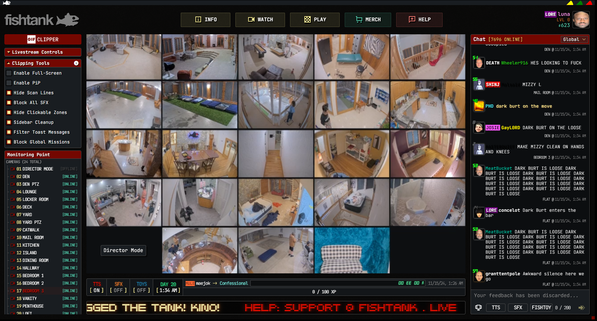

# Fishtank.live Viewer

**Fishtank.live Viewer** is a lightweight application designed for a better experience on [fishtank.live](https://fishtank.live). Available in both a [portable](https://github.com/luna-mae/fishtank.live-viewer/releases/tag/release) and an [installer](https://github.com/luna-mae/fishtank.live-viewer/releases/tag/release) version, allowing users to choose their preferred installation method. Open source. Feel free to modify.

## Table of Contents

- [Features](#features)
- [Built With](#built-with)
- [Installation](#installation)
  - [Portable Version](#portable-version)
  - [Installer Version](#installer-version)
- [Usage](#usage)

## Features

- Built-in GIF clipper, Clipping Tools++, and Livestream Control Tools.
- Easily watch fishtank in fullscreen, benefit from lower than avg resource usage(compared vs a normal browser).
- Portable and installer versions are both available.

## Built With

- **Inno Setup** 
- **WebView2**
- **C#**

## Installation

Choose from two available installation options:

1. **Portable Version** - A standalone version that doesn’t require installation; simply download, extract, and run.
2. **Installer Version** - A guided setup that installs the application on your Windows system.

### Portable Version

1. Download the latest **fishtank.zip** file from the [Releases](https://github.com/luna-mae/fishtank.live-viewer/releases/tag/release) section.
2. Extract the contents of the `.zip` file to your preferred folder.
3. Run `fishtank.live.exe` from the extracted folder.

### Installer Version

1. Download the latest **installer.exe** file from the [Releases](https://github.com/luna-mae/fishtank.live-viewer/releases/tag/release) section.
2. Double-click the `.exe` file to start the setup.
3. Follow the on-screen instructions to complete the installation.
4. Once installed, you can launch **Fishtank.live Viewer** from the Start menu or desktop shortcut (if selected during installation).

## Usage

After launching log in and you are done. All tools are bundled along with it. 
